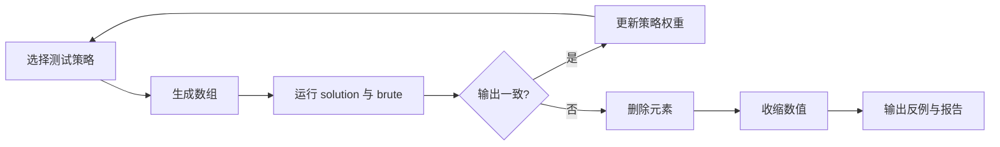

# WA Hunter

> 用差分测试自动寻找并缩小 C++ 数组算法的反例。  
> Find and minimize counterexamples for C++ array algorithms with differential testing.

WA Hunter 是一个零付费 API、零 LLM 依赖的课程项目 MVP。用户提供候选程序
`solution.cpp`、可信的小数据程序 `brute.cpp` 和配置文件，Agent 会自动编译、生成
测试、执行对拍，并在发现输出不一致后缩小反例。

WA Hunter is a dependency-free course-project MVP. Given a candidate
`solution.cpp`, a trusted `brute.cpp`, and a JSON configuration, it compiles
both programs, generates tests, compares their behavior, and minimizes the
first counterexample it finds.

**在线服务 / Live service:** [https://lenga.com.cn](https://lenga.com.cn)

## 它为什么是 Agent？ / Why is it an agent?



它执行完整的 **选择动作 → 使用工具 → 观察反馈 → 更新策略** 循环。

## 快速开始 / Quick start

需要 Python 3.9+ 和可通过 `g++` 调用的 C++17 编译器。

```powershell
python wa_hunter.py
```

默认示例是 Codeforces **Harder Horizons**：

- `examples/solution.cpp`：`O(n)` 贪心候选程序；
- `examples/brute.cpp`：独立的 `O(n^3)` 小数据动态规划 Oracle；
- `examples/config.json`：确定性测试配置。

使用自己的程序：

```powershell
python wa_hunter.py --solution path/to/solution.cpp --brute path/to/brute.cpp --config path/to/config.json
```

发现差异时程序返回退出码 `1`，并生成：

- `counterexample.txt`：仍能触发差异的最小化输入；
- `report.md`：执行状态、输出、耗时、策略和复现说明。

退出码 `0` 表示测试预算内未发现差异，**不等于证明程序正确**；退出码 `2`
表示配置、编译或环境错误。

## 一键看错误示范 / Reproducible demo

`demo/buggy_solution.cpp` 故意使用了错误的“统计相邻上升”思路。运行：

```powershell
python wa_hunter.py --solution demo/buggy_solution.cpp --brute examples/brute.cpp --config demo/config.json
```

你将得到类似 [demo/report.md](demo/report.md) 的最小反例报告。

## 测试策略 / Test strategies

每次运行首先保证覆盖七类数据，之后依据反馈进行加权选择：随机、边界、全部相等、
单调递增、单调递减、大量重复，以及最小值/最大值/零混合（范围允许零时）。发生
异常状态或输出差异的策略会获得更高的后续选择权重。固定 `seed` 可复现生成序列。

## 反例最小化 / Counterexample minimization

发现差异后，WA Hunter 会：

1. 使用分块 Delta Debugging 删除元素；
2. 尝试把每个值替换为 `0`、`1`/`-1`，并逐步向零折半；
3. 每次修改都重新运行两份程序，保证保存的输入仍是真实反例。

这是启发式最小化，不保证得到数学意义上的全局最小反例。

## ¥1 反例服务 / ¥1 Counterexample Service

不会配置环境，或者希望有人协助分析结果？可以点击仓库的 **Issues → Request a
counterexample** 提交公开请求。当前内测规则：

- 只接受第一行 `n`、第二行 `n` 个整数的数组题；
- 找到并人工确认有效反例后收费 **¥1 CNY**；
- 找不到不收费；
- 完整规则见 [SERVICE.md](SERVICE.md)。

Issue、附件和评论默认公开。不要上传私有作业、比赛中仍保密的题目、密钥、个人
信息或无权分享的代码。

## 安全 / Security

这个 MVP 会执行本地原生程序。只应在自己的计算机上运行可信代码。接受陌生人代码
前必须加入操作系统级隔离、资源限制和任务队列。详情见 [SECURITY.md](SECURITY.md)。

## 在线服务 / Hosted service

`lenga.com.cn` 已部署受控版本：注册用户可以提交两份 C++17 源码，任务通过
单并发后台队列进入 Firejail，在私有结果页查看反例和报告。生产迁移、安全边界与
回滚方案见 [docs/SERVER_DEPLOYMENT.md](docs/SERVER_DEPLOYMENT.md)，服务端源码见
[server/](server/)。

## 开发与许可 / Development and license

```powershell
python -m unittest discover -s tests -v
python -m py_compile wa_hunter.py
```

项目采用 [MIT License](LICENSE)。欢迎提交 Bug、测试策略和新的输入模型。
